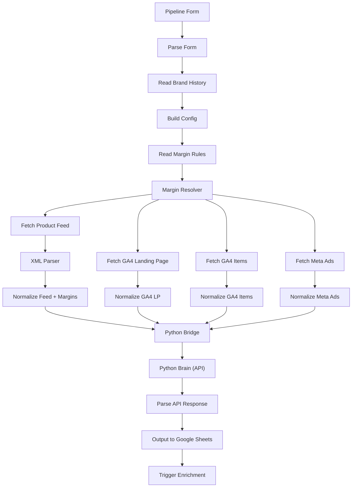

# MSC_ALGO v5 Hybrid — AiDoc

> **Twin Documentation** for `MSC_ALGO_v5_Hybrid.json` (per n8n-architect RULE 4)

| Field | Value |
|-------|-------|
| **File** | `Workflows/MSC_ALGO_v5_Hybrid.json` |
| **Trigger** | FormTrigger (manual) |
| **Status** | Production |
| **Version** | v5.1.0 |
| **Updated** | 2026-02-17 |

## Data Flow

## Input Data Sources

| Source | Node | Fields |
|--------|------|--------|
| Product Feed (XML) | Fetch Product Feed | feed_id, feed_title, feed_brand, feed_price, feed_category, feed_link, feed_image_link |
| GA4 Landing Pages | Fetch GA4 LP | sessions, purchaseRevenue, ecommercePurchases, totalUsers, firstTimePurchasers |
| GA4 Item Scoped | Fetch GA4 Items | itemId, itemsViewed, itemRevenue, itemsPurchased |
| Meta Ads Insights | Fetch Meta Ads | spend, actions (purchases), action_values (revenue), website_url |
| Brand Config | Read Brand History | brand_name, vat_rate, default_margin, currency, ga4_property_id, meta_account_id |
| Margin Rules | Read Margin Rules | match_type (SKU_EXACT/CATEGORY_EXACT/KEYWORD/DEFAULT), match_value, margin_rate |

## Node-by-Node Business Logic

### 1. Pipeline Form → Parse Form

- User enters: Brand Name, Feed URL, Data Sheet URL, optional dates and IDs
- `Parse Form` normalizes `_brand_key` to lowercase, sets 12-month default date range

### 2. Read Brand History → Build Config

- Reads `brand_config` sheet from Google Sheets
- Matches brand by `brand_name`
- Extracts: `VAT_RATE`, `DEFAULT_MARGIN`, `CURRENCY` (default PLN), GA4/Meta IDs
- Falls back to hardcoded IDs for known brands (Iiyama, Bushido, Koszulkowy, Mindlink)
- **Throws error** if brand not found in sheet

### 3. Read Margin Rules → Margin Resolver

- Reads `margin_rules` sheet
- Separates `DEFAULT` rule from matching rules (SKU_EXACT, CATEGORY_EXACT, KEYWORD)
- If DEFAULT rule exists in sheet, overrides `DEFAULT_MARGIN` from config
- Outputs merged config with `MARGIN_RULES` array

### 4. Feed Pipeline (Fetch → XML Parser → Normalize Feed + Margins)

- HTTP GET to feed URL, parses XML
- Extracts: `g:id`, `g:title`, `g:brand`, `g:price`, `g:product_type`, `g:link`, `g:image_link`
- Resolves per-product margin: SKU_EXACT → CATEGORY_EXACT → KEYWORD → DEFAULT
- Normalizes URL path for SmartMatcher

### 5. GA4 Landing Page (Fetch → Normalize)

- GA4 Data API v1beta `runReport` with 5 metrics, ordered by sessions DESC, limit 1000
- Normalizes to: `ga4_lp_url`, `ga4_norm_path`, `ga4_sessions`, `ga4_revenue`, `ga4_trans`, `ga4_users`, `ga4_first_time_purchasers`

### 6. GA4 Items (Fetch → Normalize)

- GA4 item-scoped report
- Normalizes to: `ga4_item_id`, `ga4_item_views`, `ga4_item_rev`, `ga4_item_purch`

### 7. Meta Ads (Fetch → Normalize)

- Facebook Marketing API ad-level insights
- Normalizes to: `meta_spend`, `meta_purch`, `meta_rev`, `meta_url`, `meta_ad_name`

### 8. Python Bridge

- 4-input merge node (Feed, GA4 Items, GA4 LP, Meta Ads)
- Consolidates all streams + config into single JSON payload
- Sends to Python API

### 9. Python Brain (API)

- `POST /process` to FastAPI server
- SmartMatcher cascade join (ID → Regex → Tokenizer)
- Waterfall classification (P1–P8, P99)
- Price clustering (integer labels), bidding strategy
- Returns 44-column gold standard output

### 10. Parse API Response → Output to Google Sheets → Trigger Enrichment

- Safety wrapper for API response formatting
- Writes to `msc_algo_output` sheet
- Triggers Enrichment Pipeline webhook

## Configuration

| Parameter | Source | Default |
|-----------|--------|---------|
| VAT_RATE | brand_config sheet | 0.23 |
| DEFAULT_MARGIN | brand_config / margin_rules DEFAULT | 0.10 |
| CURRENCY | brand_config sheet | PLN |
| MIN_META_TRANS | hardcoded | 10 |
| MIN_ORGANIC_SESSIONS | hardcoded | 300 |
| MAX_OUTPUT_ROWS | Python pipeline | 1000 |

## Error Handling

- **Build Config**: Throws if brand not found in `brand_config` sheet
- **Build Config**: Throws if GA4 or Meta ID missing
- **Python API**: 120s timeout, returns error JSON on failure
- **Parse API Response**: Safety wrapper catches malformed API responses

## Edge Cases

- **Empty feed_id from n8n**: Treated as missing (empty string = NaN) for entity_type classification
- **Landing pages with no feed match**: Classified as `CATEGORY_OR_AD`
- **Row limit**: Active rows prioritized, empty rows fill remaining capacity up to 1000
- **Price cluster**: Returns integer (max price in cluster) for spreadsheet sorting
