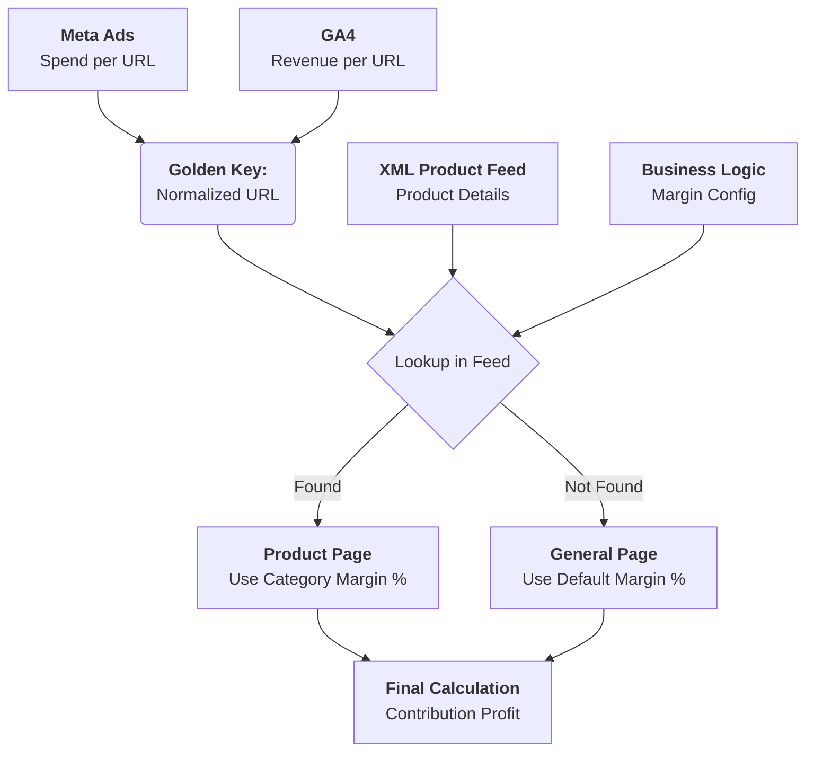

# Join Logic Documentation

## Overview

The "Join Logic" is the core engine that merges disconnected data sources (Meta Ads, GA4, Product Feed) to answer one fundamental question:
**"Is this Landing Page profitable?"**

We use a **Landing Page Centric** approach, meaning the primary key for all analysis is the **Normalized URL**.

## 1. Data Flow

## 2. URL Normalization (The Golden Key)

To join data effectively, we must "clean" the URLs to a common standard.
Function: `normalize_url(url)`

| Input (Messy) | Output (Normalized) |
| :--- | :--- |
| `https://bushido-sport.pl/buty?utm_source=fb` | `bushido-sport.pl/buty` |
| `www.bushido-sport.pl/buty/` | `bushido-sport.pl/buty` |
| `BUSHIDO-SPORT.PL/Buty` | `bushido-sport.pl/buty` |

## 3. Financial Logic

### A. Margin Mapping

Since the XML Feed does not contain cost data, we apply **Gross Margin %** based on the product's category (defined in `business_logic.json`).

- **Product Match**: Margin = `Category Override` (if exists) OR `Default Brand Margin`.
- **No Match (General Page)**: Margin = `Default Brand Margin` (Conservative estimate for portfolio profitability).

### B. Contribution Profit

This is our **North Star Metric**. It tells us the real value left after satisfying tax, product cost, and ad spend.

1. **Net Revenue**:
    $$ \text{Net Revenue} = \frac{\text{Gross Revenue (GA4)}}{1 + \text{VAT Rate}} $$

2. **COGS (Cost of Goods Sold)**:
    $$ \text{COGS} = \text{Net Revenue} \times (1 - \text{Gross Margin \%}) $$

3. **Contribution Profit**:
    $$ \text{Contribution Profit} = \text{Net Revenue} - \text{COGS} - \text{Ad Spend (Meta)} $$

## 4. Output: Landing Page Report

The final output (`Landing_Page_Report.csv`) allows us to see:

- **High Profit LPs**: Scale budget.
- **Low Profit LPs**: Optimize creative or kill.
- **Unassigned Spend**: None (all spend is attached to a URL).
