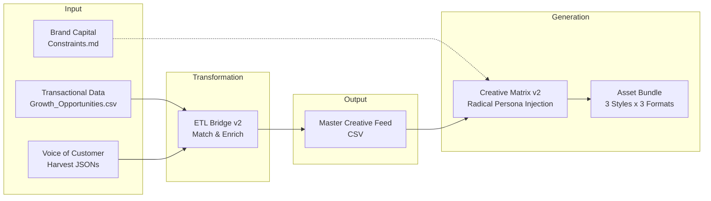

# Creative Data Pipeline - System Architecture

> **Version:** 2.0 (Operation Ugly Truth)
> **Goal:** Automated Massive Native Ad Testing (MNAT)
> **Core Philosophy:** The Creative Matrix (1 Product × 3 Radical Styles)

---

## 1. System Overview

The Creative Data Pipeline transforms raw transactional data and unstructured customer feedback into high-variance creative assets. It abandons the search for the "perfect ad" in favor of generating multiple conflicting viewpoints (The Matrix) to test what resonates.



---

## 2. Data Sources & Ingestion

### Unstructured Input (The "Red Lines")

- **Source:** Onboarding Transcripts (DOCX)
- **Artifact:** `config/BRAND_CONSTRAINTS.md`
- **Logic:** Identifies "Hard Constraints" (Vetoes) vs "Soft Context" (Flavor).
- **Usage:** Used by the Generator to block illegal claims (e.g., "Factory Calibrated" on budget models).

### Structured Input (The "Bag of Tags")

- **Source:** `Assessment_Report` (CSV) + `Simulated Harvest` (JSON)
- **Logic:** We do not map 1:1. We create "Pools" of tags (Pains, Dreams, Slang) that the Generator can sample from.
- **Deep Benefit Mapping:** The `TECH_TRANSLATOR` does not just translate specs; it translates *features* into *advantages*.
  - *Input:* `165Hz`
  - *Regex:* `r'\b165\s*Hz\b'`
  - *Output:* `Widzisz wroga zanim on zobaczy Ciebie (Przewaga 165Hz)`

---

## 3. The ETL Transformation Engine

**Script:** `src/creative_data_bridge_v2.py`

### core Logic: The Matching Cascade

The system must determine the product's "Vertical" (Gaming, Office, Signage) to apply the correct VOC data.

1. **Priority 1: SKU Regex Match**
    - `GB*`, `G-Master` -> **Gaming**
    - `LH*`, `TE*` -> **Signage**
    - `XUB*` -> **ProGraphics**
    - `ProLite` -> **Office**
2. **Priority 2: Category Fallback**
    - If SKU fails, check `feed_category` string for keywords.
3. **Default:** Office (Safe fallback).

### The "So What?" Engine (Tech Translator)

Transforms specs into emotional leverage.

1. **Regex Extraction:** Scans `title` + `category` for patterns.
2. **SKU Fallback:** If Regex finds nothing, looks up optimal benefits in `SKU_FALLBACK_SPECS` dictionary (hardcoded for top-tier products).
3. **Sanitization:** Joins benefits with ` | ` for CSV compatibility.

---

## 4. The Creative Matrix Engine

**Script:** `src/creative_generator_v2.py`

This is the system's core value constraint. It forces every product through 3 distinct, conflicting psychological frameworks.

### The 3 Matrix Styles (The "Quadrants")

#### 🏛️ AESTHETIC (The Whisper)

* **Goal:** Status, Perfection, Identity.
- **System Prompt:** "Minimalist Brand Strategist. Use sentence fragments. Whisper power."
- **Visuals:** Studio lighting, 8K, no clutter, floating product.
- **Use Case:** Retargeting, High-Income.

#### 📸 NATIVE RAW (The Scream)

* **Goal:** Trust, Authenticity, "Anti-Marketing".
- **System Prompt:** "Angry Forum User. Use slang. **ADMIT A FLAW** to prove the win."
- **Visuals:** Flash ON, messy desk, grain, POV shot, fingerprint on bezel.
- **Use Case:** Cold Traffic, Feed Scroll-stoppers.

#### ⚠️ PATTERN INTERRUPT (The Alarm)

* **Goal:** Curiosity, FOMO, Warning.
- **System Prompt:** "Tabloid Editor. 'Us vs Them' framing. Warning/Leak headline."
- **Visuals:** Split screen, red circles (MS Paint style), yellow warning tape, high contrast.
- **Use Case:** High CTR, Problem-Aware.

### Brand Safety Layer

Before saving any asset, the script runs `apply_brand_safety(text)`:

1. **Vetoes:** Removes banned phrases (e.g., "intuitive controls" which is false for iiyama).
2. **Rewrites:** Transforms negative sentiment into positive framing where allowed (e.g., "Service sucks" -> "Service is slow, BUT...").

---

## 5. Deployment & Usage

### Directory Structure

```
Project/
├── Input/
│   └── [Brand]/
│       ├── RAW_HARVEST_DATA_*.json
│       └── [Brand]_Growth_Opportunities.csv
├── Src/
│   ├── creative_data_bridge_v2.py  # ETL
│   └── creative_generator_v2.py    # Generator
├── Output/
│   └── [Brand]/
│       ├── MASTER_CREATIVE_FEED_[Brand].csv
│       └── output_matrix/          # Final Assets
            ├── [Product]/
            │   ├── Aesthetic/
            │   ├── Native/
            │   └── Interrupt/
```

### Execution Commands

1. **Run ETL:**

    ```bash
    python src/creative_data_bridge_v2.py Iiyama
    ```

2. **Run Generator:**

    ```bash
    python src/creative_generator_v2.py Iiyama
    ```

---

## 6. Maintenance & Troubleshooting

### Common Issues

* **Empty Tech Translator:** If a product output refers to "General" specs, add its SKU pattern to `SKU_FALLBACK_SPECS` in `creative_data_bridge_v2.py`.
- **Wrong Vertical:** If a Gaming monitor is classified as Office, update the Regex pattern in `match_product_to_vertical`.
- **Banned Phrases in Output:** Add new negative phrases to `BRAND_SAFETY_VETOES` in `creative_generator_v2.py`.

### Extensibility

To add a 4th style (e.g., "Educational"):

1. Define `EDUCATIONAL` in `STYLE_PRESETS` inside `creative_generator_v2.py`.
2. Add `EDUCATIONAL` prompt logic to `generate_copy` and `generate_image_prompt`.
3. Add to the loop in `run_matrix_generator`.
