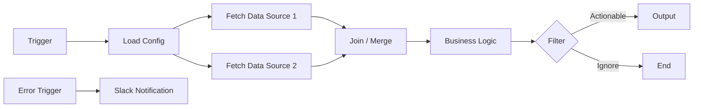

# AiDoc Template — Workflow Documentation

> Copy this template and fill in the sections for every `.n8n` / `.json` workflow file.
> Save as `[WorkflowName].md` in the same directory as the JSON file.

---

# Workflow: [Workflow Display Name]

> [One-sentence description of what this workflow does and why it exists]

## Metadata

| Field | Value |
|---|---|
| **File** | `[filename].n8n` |
| **Trigger** | Schedule / Webhook / Manual |
| **Status** | Active / Draft / Disabled |
| **Owner** | [Name] |
| **Last Updated** | [YYYY-MM-DD] |
| **n8n Version** | [e.g., 1.54.4] |

## Data Flow

## Input Data Sources

| Source | Node Name | Description |
|---|---|---|
| [API/DB/File] | [Node Name] | [What data, what format] |

## Business Logic

### [Code Node Name 1]

**Purpose:** [What this code does]

**Input:** [What data it receives]

**Logic:**

- [Step 1]
- [Step 2]

**Output:** [What data it produces]

### [Code Node Name 2]

[Repeat for each Code node]

## Configuration

| Parameter | Value | Source |
|---|---|---|
| [e.g., VAT Rate] | [0.23] | [Load Config node / $env] |

## Error Handling

- **Error Trigger:** Connected to [Slack / Email / Discord]
- **Channel:** `[#channel-name]`
- **Alert Format:** Workflow name, failing node, error message, timestamp

## Idempotency

- **Guard:** [How duplicates are prevented]
- **Unique Key:** [What field is used as dedup key]

## Edge Cases & Known Issues

- [Document any known limitations or edge cases]

---

*Generated by N8N Architect — Twin Documentation Protocol*
